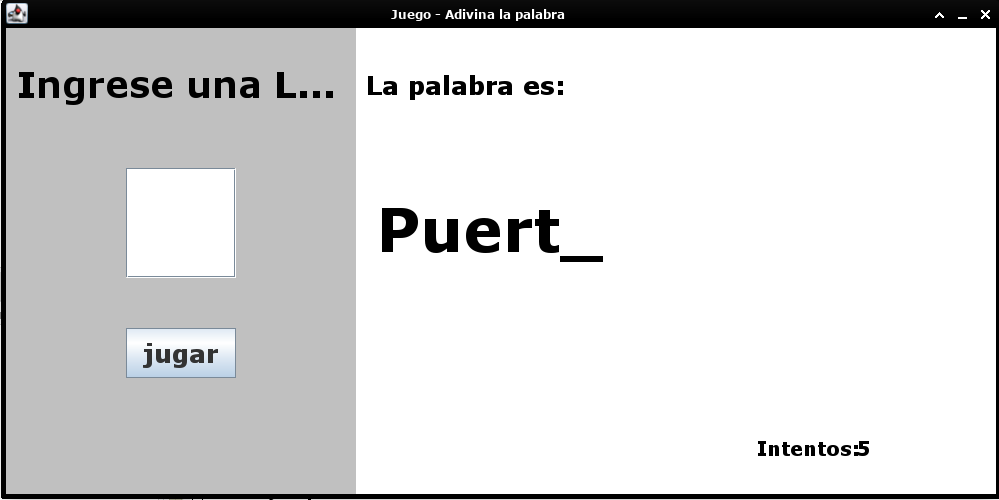

# Complete The Word

Complete The Word es un programa de adivinanza de palabras. El objetivo del programa es seleccionar una palabra al azar de un archivo de texto y permitir al usuario adivinar la palabra. 

## Descripción del Proyecto

El programa funciona de la siguiente manera:

1. Lee las palabras desde un archivo de texto llamado `datos.txt` ubicado en la carpeta `src/main/resources`.
2. Selecciona una palabra al azar de la lista de palabras leídas.
3. Permite al usuario adivinar la palabra seleccionada.

El archivo de texto debe contener una palabra por línea. El programa cuenta el número de líneas en el archivo y luego selecciona una línea al azar para escoger la palabra a adivinar.

## Captura de Pantalla

